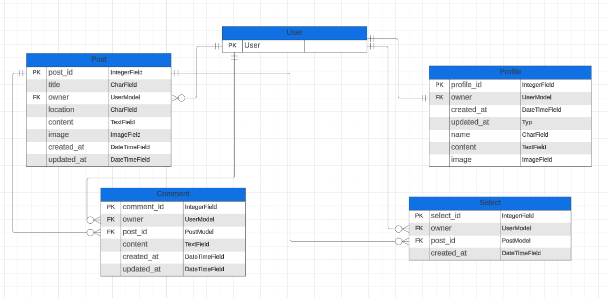

# Celiac's Choice - API

This is the README that provides information about the API in the Celiac's Choice project.

You can acess the API [here.](https://celiacs-api-bf52b941b62a.herokuapp.com/)

The application is developed using the Django Rest framework for the Back end and React for the Front end. 

This is the Back end part of the project, the Front end part can be found [here](https://github.com/SofiaNords/celiacs-choice).

## Table of Content

- [Celiac's Choice - API](#celiacs-choice---api)
- [Table of Content](#table-of-content)
- [Entity Relationship Diagram](#entity-relationship-diagram)
- [Technologies Used](#technologies-used)
    - [Languagaes Used](#languages-used)
    - [Database Used](#database-used)
    - [Frameworks Libraries Tools & Programs Used](#frameworks-libraries-tools--programs)
- [Testing](#testing)
- [Bugs](#bugs)
- [Deployment](#deployment)

## Entity Relationship Diagram

## Technologies Used

### Languages Used

- Python

### Database Used

- [PostgreSQL](https://dbs.ci-dbs.net/manage/) - Used to store the data

### Frameworks, Libraries, Tools & Programs

- [Cloudinary](https://cloudinary.com/) - Used to store images
- [Django](https://www.djangoproject.com/) - Used for rapid, reusable and secure development
- [django-allauth](https://docs.allauth.org/) - Used for authentication, registration and account management
- [Django-Filter](https://django-filter.readthedocs.io/en/stable/) - Used to add filters in search feature
- [Django REST Framework](https://www.django-rest-framework.org/) - Used for buildning Web API
- [Django REST Framework Simple-JWT](https://django-rest-framework-simplejwt.readthedocs.io/) - Used for securing DJANGO APIs using JSON Web Tokens
- [django-cors-headers](https://pypi.org/project/django-cors-headers/) - Used to handle web requests to the application
- [dj-database-url](https://pypi.org/project/dj-database-url/) - Used to configure the application and define the database connection in an url
- [dj-rest-auth](https://dj-rest-auth.readthedocs.io/) - Used for handling authentication securely
- [Git](https://git-scm.com/) - Used for version control
- [GitHub](https://github.com/) - Used to store the code
- [GitPod](https://www.gitpod.io/) - Used as the IDE for development
- [Gunicorn](https://docs.djangoproject.com/en/4.2/howto/deployment/wsgi/gunicorn/) - Used as the Web Server to run Django on Heroku
- [Heroku](https://dashboard.heroku.com/) - Used to deploy the API
- [Lucidchart](https://www.lucidchart.com/) - Used to create Entity Relationship Diagrams (ERD)
- [Psycopg](https://pypi.org/project/psycopg2/) - Used as a database adapter to support the connection to database

## Testing

The API was tested by interacting with the Front End. 

[Test Document](https://docs.google.com/spreadsheets/d/1cT4z1t5p8EcwzSDX7WlpFXLf3zcVW32OgnlrwBf_hpk/edit?usp=sharing)

## Bugs

I realised that the comment I entered on one post was visible on all posts.
After troubleshooting in the frontend, I got a tip from Tutor Support to look in the backend.
It turned out that I missed to put DjangoFilterBackend in my Comment View.
After fixing this, the comments worked as they should. The comment was only visible on the 
post it was added to.

## Deployment

The API was deployed using the Heroku platform and can be accessed [here.](https://celiacs-api-bf52b941b62a.herokuapp.com)

1. Create required accounts: If you haven't done so yet, create accounts on Heroku and Cloudinary. These services are necessery for hosting the application and storing images.

2. Create a database: I used [PostgreSQL](https://dbs.ci-dbs.net/manage/) from Code Institute. 

3. Create a new application on Heroku: From your Heroku dashboard, create a new application and select the appropriate region.

4. Install and configure extra libraries: Compare with requirements.txt

5. Create a Procfile: Add release and web info to let Heroku know how to run the project.

6. Set environment variables: In you local env.py file, set your environment variables ('CLOUDINARY_URL', 'DEV', 'DATABASE_URL', 'SECRET_KEY'). These variables should also be added to your Heroku app settings under the Config Vars section. This ensures that these services can communicate with your Heroku app. Create a session authentication value (differentiates between Dev and Prod mode): os.environ['DEV']='1'

7. Database management: Ensure that all database migrations have been made and the current state of your models is reflected in the database schema. 

8. Deployment process: In your Heroku dashboard, go to your application's deploy page. Connect your GitHub repository to your Heroku application under the "Deployment method" section. Under the "Manual deploy" section, select the branch you want to deploy and click "Deploy Branch".

9. Verify Deployment: Once the deployment is successful, Heroku will provide an URL to access the live application. Test the application to ensure all components are functioning properly. 

Fork the repository

1. Got to the GitHub repository.

2. Click the button with FORK on it on your right hand side.

3. A new page "Create new Fork" will open, you can also edit the name if you would like.

4. At the bottom of the page - click on CREATE FORK.

5. Now you have a copy of the project in your repositories.

Clone the repository

1. Go to the GitHub repository.

2. Click on the Code tab and copy the web URL.

3. Open the terminal in the code editor of your choice, and change the current working directory to the one you will use to clone the repository.

4. Type: "git clone" inte the terminal and then paste the link you copied before and press ENTER.
